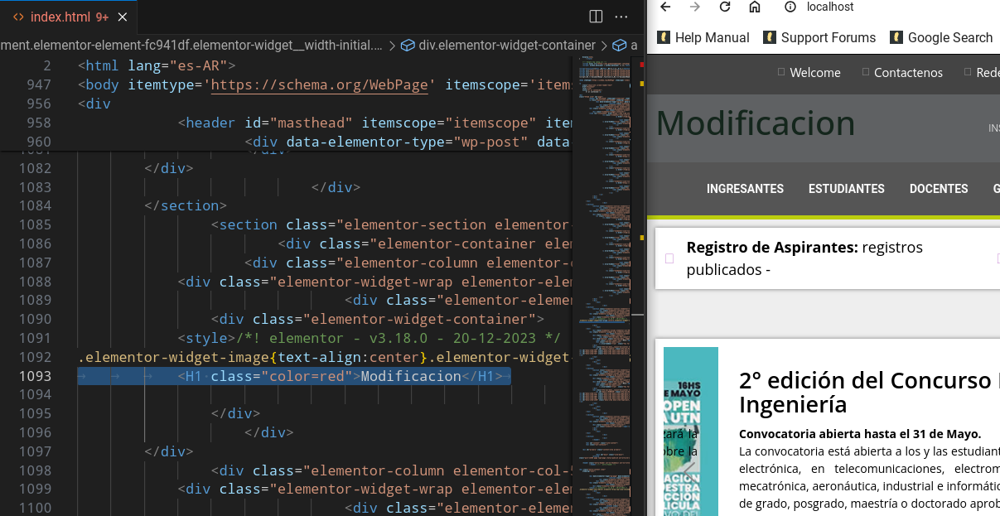

# Trabajo Practico Nro 3

<h2>Ejecucion de <code>sinhilos.py</code> y <code>conhilos.py</code></h2>

<h3> a) 

 Resultados de la ejecución 

<table style= "border-collapse: collapse; width: 100%; text-algin: left;">

<thead>
<tr>
    <th style="border:1px solid #dddddd; padding :8px;"> Ejecición</th>
    <th style="border:1px solid #dddddd; padding :8px;"><code>sinhilos.py</code></th>
    <th style="border:1px solid #dddddd; padding :8px;"> <code>conhilos.py</code></th>
</tr>
</thead>
<tbody>
    <tr>
        <td style="border:1px solid #dddddd; padding :8px;"> Ejecición 1</td>
        <td style="border:1px solid #dddddd; padding :8px;">5.23 </td>
        <td style="border:1px solid #dddddd; padding :8px;"> 4.04</td>
    </tr>
    <tr>
            <td style="border:1px solid #dddddd; padding :8px;"> Ejecición 2</td>
            <td style="border:1px solid #dddddd; padding :8px;"> 5.22</td>
            <td style="border:1px solid #dddddd; padding :8px;"> 4.05</td>
    </tr>
    <tr>
            <td style="border:1px solid #dddddd; padding :8px;"> Ejecición 3</td>
            <td style="border:1px solid #dddddd; padding :8px;"> 5.24</td>
            <td style="border:1px solid #dddddd; padding :8px;"> 4.05</td>
    </tr>
    </tbody>
    </table>

<strong>OBSERVACIONES:</strong

<ul>
    <li>El tiempo de ejecucion de ambos <code>.py</code> ejecutables, es predecible ya que <code>sinhilos.py</code>ejecuta las tareas dadas de forma secuencial, es decir, constante, por ejemplo, <code>time.sleep(1)</code> "duerme" el proceso exactamente 1 segundo. Y en cambio <code>time.sleep(4)</code> duerme el prceso 4 segundos, por lo tanto la suma de estos tiempos dan 5.23 segundos.</li>
     
    <li>Mientras que <code>conhilos.py</code>actua y ejecuta las tareas en paralelo usan dichos hilos. Esto produce que tarea, tarea 2 y tarea 3 comiencen simultaneamente y el timepo total que tarde en ejecutarse será dada por la tarea mas larga, en este caso es <code>tarea_3</code>con <code>time.sleep(4)</code>lo que da como resultado un aprximado de 4.05 de ejecución.</li>
</ul>

<h3>b) Comparaciones con un compañero</h3>

Al comparar los tiempo de ejecucion con un compañero, observamos diferencias pero menores, y en algunos casos nulas diferencias, esto puede variar por el hadware de cada uno.

<h3>c) Ejecucion del archivo <code>suma_resta.py</code></h3>

<strong>OBSERVACIONES<strong>

<ul>
    <li>
    
CODIGO ORIGINAL: 

    En la primera versión del código, los dos hilos trabajan con la variable "acumulador" sin coordinarse. Esto puede causar un problema llamado "carrera crítica", donde los hilos compiten por acceder y cambiar "acumulador", lo que lleva a resultados impredecibles.
    </li>
    <li>
CODIGO MODIFICADO:

    Al eliminar los comentarios, las acciones de sumar y restar en los hilos continúan sin coordinarse, lo que agrava el problema.
    </li>
</ul>

<h3>2. B</h3>

<a href="TP3/raceccondition.c">RACE CONDITION - CORREGIDO </a>
 
 
### Diagrama de Flujo:

# TRABAJO PRACTICO N°4

<h2>En este proyecto se manipulan los siguientes servicios: <code>Docker compose</code></h2>

## CAPTURAS DE PANTALLA: 

### IMAGEN 1

### IMAGEN 2

### IMAGEN 3

### IMAGEN 4

## FINALIZACION: 

### IMAGEN 5

### IMAGEN 6

### IMAGEN 7

